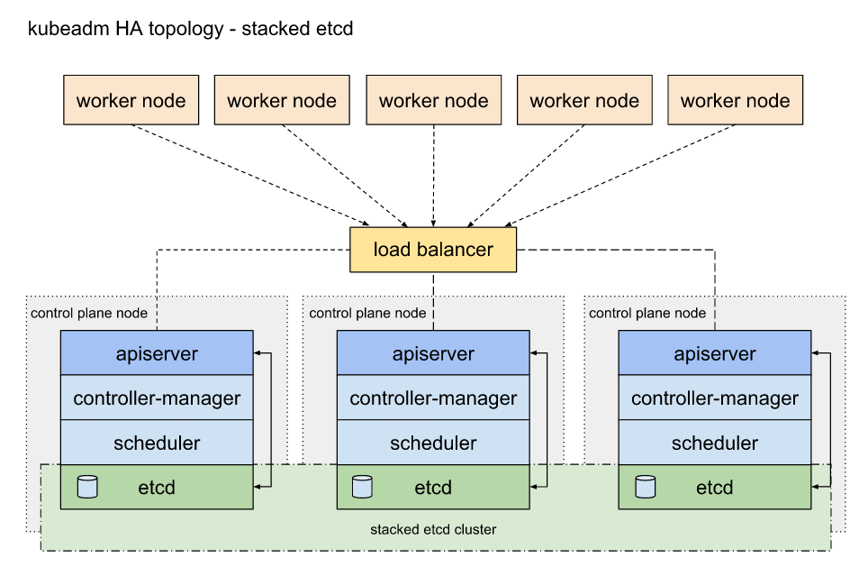
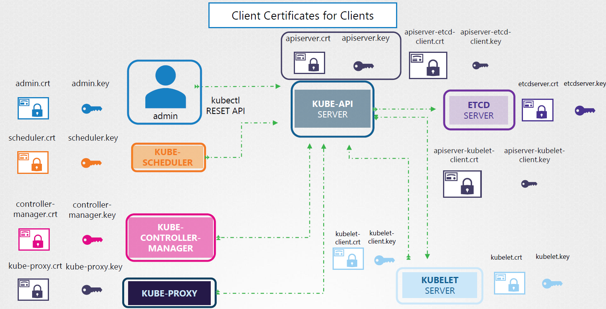

# kubernetes playground

```
eksctl get cluster --name=cluster01
eksctl get cluster --name=cluster01 -o json | jq -r .

eksctl get nodegroup --cluster=cluster01
eksctl get nodegroup --cluster=cluster01 --name=cluster01-group01
eksctl get nodegroup --cluster=cluster01 --name=cluster01-group01 -o json | jq -r .
```

```
aws iam list-roles | jq -r .Roles[].RoleName
aws iam get-role --role-name eks-cluster
aws iam get-role --role-name eks-node

aws ec2 describe-instances | jq -r '.Reservations[].Instances[]|.InstanceId + ":" + .State.Name + ":" + .PublicDnsName'
aws ec2 stop-instances --instance-ids i-0609ebe60c7431156
aws ec2 start-instances --instance-ids i-0609ebe60c7431156

aws eks list-clusters | jq -r .clusters[]
aws eks describe-cluster --name cluster01

aws eks list-nodegroups --cluster-name cluster01 | jq -r .nodegroups[]
aws eks describe-nodegroup --cluster-name cluster01 --nodegroup-name cluster01-group01

aws eks update-kubeconfig --region ca-central-1 --name cluster01
```

```
kubeadm init --apiserver-advertise-address=192.168.56.101 --pod-network-cidr=10.0.0.0/16
kubeadm init --apiserver-advertise-address=192.168.56.201 --pod-network-cidr=10.0.0.0/16

kubeadm certs check-expiration
kubeadm certs renew all

kubeadm config images list
kubeadm config images pull

kubeadm token list
kubeadm token create --print-join-command

kubeadm upgrade plan
kubeadm upgrade apply v1.22.1 --dry-run --yes
```



