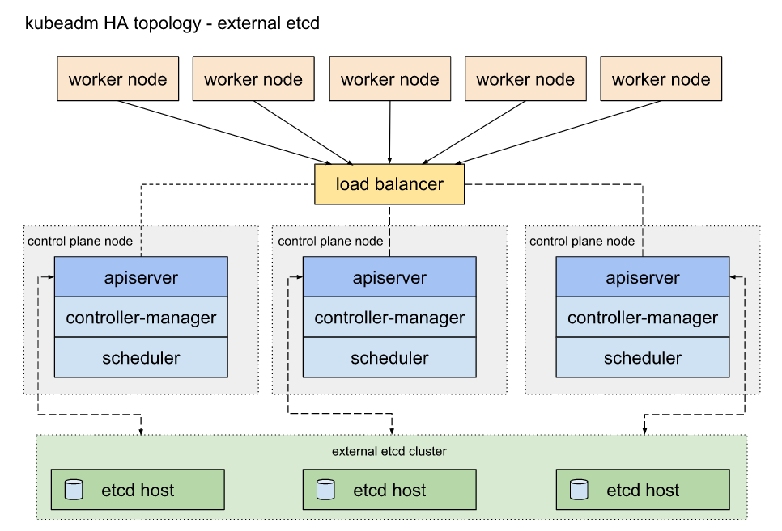

# kubernetes

```
kubeadm init --pod-network-cidr=192.168.0.0/16
kubeadm certs check-expiration
kubeadm certs renew all

kubeadm config images list
kubeadm config images pull

kubeadm token list
kubeadm token create --print-join-command

kubeadm upgrade plan
kubeadm upgrade apply v1.22.1 --dry-run --yes

kc get -o json po -A | jq -r '.items[].metadata|"kubectl -n " + .namespace + " delete po " + .name'
```




