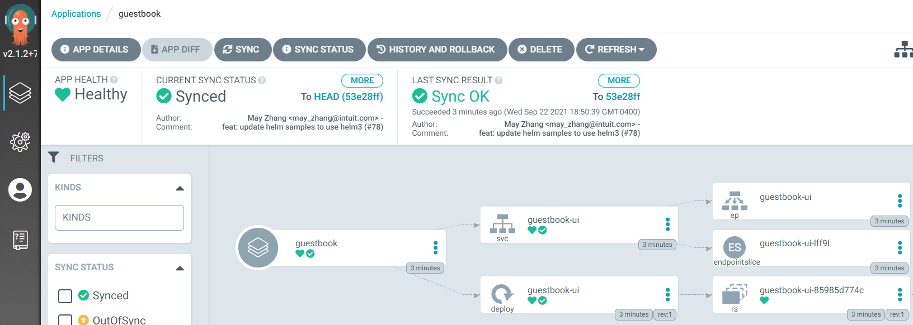

# argocd

```
kc -n argocd get secret -o json argocd-initial-admin-secret | jq -r .data.password | base64 -d
kc -n argocd port-forward --address 0.0.0.0 svc/argocd-server 8080:443

argocd login --insecure --username admin localhost:8080
argocd account update-password

argocd cluster list
argocd cluster add kubernetes-admin@kubernetes

argocd proj create argo-demo \
--description "Argo demo project" \
--src https://github.com/argoproj/argocd-example-apps.git \
--dest https://kubernetes.default.svc,argo-demo \
--allow-cluster-resource "*/*"

argocd proj list
argocd proj get argo-demo
argocd proj delete argo-demo

argocd app create guestbook \
--repo https://github.com/argoproj/argocd-example-apps.git \
--path guestbook \
--dest-server https://kubernetes.default.svc \
--dest-namespace argo-demo \
--project argo-demo

argocd app list
argocd app get guestbook
argocd app sync guestbook
argocd app delete -y guestbook
```


