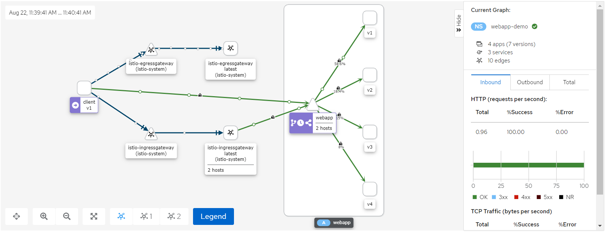

# istio service mesh



```
curl -sL https://istio.io/downloadIstioctl | sh -

istioctl operator init
istioctl profile dump demo > vendor.install.yaml

helm repo add kiali-server https://kiali.org/helm-charts
helm repo update
helm search repo kiali
helm -n istio-system template kiali-server kiali-server/kiali-server
helm -n istio-system install kiali-server kiali-server/kiali-server

kubectl get ns -L istio-injection
kubectl get ns -l istio-injection

kubectl label ns hashi-demo istio-injection=enabled
kubectl label ns webapp-demo istio-injection=enabled

kubectl label ns hashi-demo istio-injection-
kubectl label ns webapp-demo istio-injection-

kubectl -n istio-system get -o json secret -l istio-token=kiali | jq -r .items[].data.token | base64 -d
```

```
openssl req -x509 -sha256 -nodes -days 365 -newkey rsa:2048 \
-subj '/O=example Inc./CN=example.com' -keyout example.com.key -out example.com.crt

openssl req -out httpbin.example.com.csr -newkey rsa:2048 -nodes \
-keyout httpbin.example.com.key -subj "/CN=httpbin.example.com/O=httpbin organization"

openssl x509 -req -days 365 -CA example.com.crt -CAkey example.com.key \
-set_serial 0 -in httpbin.example.com.csr -out httpbin.example.com.crt


openssl req -x509 -sha256 -nodes -days 365 -newkey rsa:2048 \
-subj '/O=example Inc./CN=example.com' -keyout example.com.key -out example.com.crt

openssl req -out hashi-demo.example.com.csr -newkey rsa:2048 -nodes \
-keyout hashi-demo.example.com.key -subj "/CN=hashi-demo.example.com/O=hashi-demo organization"

openssl x509 -req -days 365 -CA example.com.crt -CAkey example.com.key \
-set_serial 0 -in hashi-demo.example.com.csr -out hashi-demo.example.com.crt


kubectl -n istio-system create secret tls httpbin-credential \
--key=httpbin.example.com.key --cert=httpbin.example.com.crt

kubectl -n istio-system create secret tls hashi-demo-credential \
--key=hashi-demo.example.com.key --cert=hashi-demo.example.com.crt

kubectl -n istio-system port-forward --address 0.0.0.0 svc/grafana 3000:3000
kubectl -n istio-system port-forward --address 0.0.0.0 svc/tracing 8080:80
kubectl -n istio-system port-forward --address 0.0.0.0 svc/kiali 20001:20001
kubectl -n istio-system port-forward --address 0.0.0.0 svc/istio-ingressgateway 8443:443


curl -v -HHost:httpbin.example.com \
--resolve httpbin.example.com:8443:127.0.0.1 \
--cacert example.com.crt https://httpbin.example.com:8443/webapp

curl -v -HHost:hashi-demo.example.com \
--resolve hashi-demo.example.com:8443:127.0.0.1 \
--cacert example.com.crt https://hashi-demo.example.com:8443/
```
